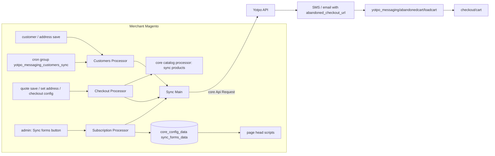
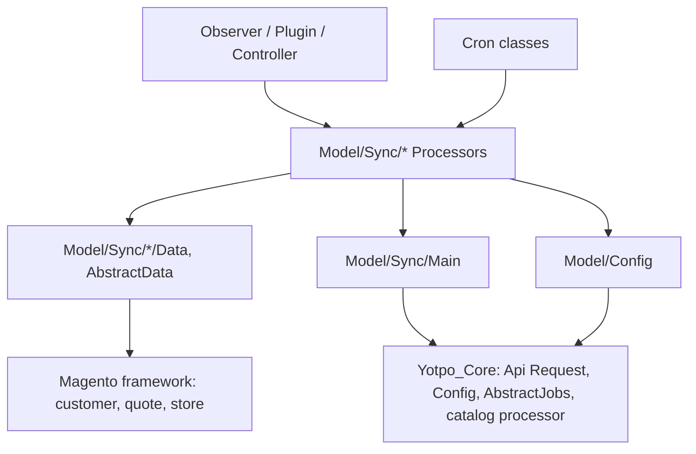

# Architecture

## System Overview
This repository is one Magento 2 module, `Yotpo_SmsBump` (`registration.php:4`), shipped as the Composer package `yotpo/module-yotpo-messaging` (`composer.json:2`) [1]. Merchants install it into their own Magento store next to `Yotpo_Core` (`yotpo/module-yotpo-core`), which it must load after (`etc/module.xml:4-6`). Nothing here runs at Yotpo: every line runs in a merchant's web requests, cron and `bin/magento`.

The module does five things:
1. **Customer sync**: sends Magento customers to the Yotpo API (`PATCH customers`), by cron and on every customer or address save.
2. **Checkout sync**: sends the current quote to the Yotpo API (`PATCH checkouts`) when an address is set or the quote is saved. Yotpo uses it for abandoned-cart messages.
3. **Abandoned-cart link**: a storefront route that restores a cart from a token in the message link.
4. **SMS-marketing consent**: a customer attribute `yotpo_accepts_sms_marketing` with a checkbox on registration, account edit and checkout.
5. **Storefront scripts**: subscription forms fetched from the Yotpo API, the browse-abandonment script, and optional Klaviyo form capture, all in the page head (`view/frontend/layout/default.xml`).

## Module Map
Owner of every module: team Orbits (`CODEOWNERS`, commit `6120391`, ORB-1246).

| Module | Responsibility | Key Files | Owner |
|--------|---------------|-----------|-------|
| Config | Config paths, API endpoint names, feature switches. Extends core's config | `Model/Config.php`, `etc/config.xml`, `etc/adminhtml/system.xml` | Orbits |
| API call wrapper | Adds the per-entity log handler, then calls core's `Yotpo\Core\Model\Api\Request::send` | `Model/Sync/Main.php` | Orbits |
| Customer sync | Batch (cron, CLI retry) and real-time customer sync; `yotpo_customers_sync` bookkeeping | `Model/Sync/Customers/*`, `Model/Sync/Customers/Cron/*`, `Model/Sync/Customers/Services/*`, `Observer/CustomerSaveAfter.php`, `Observer/CustomerAddressUpdate.php` | Orbits |
| Checkout sync | Builds the checkout payload from the quote and sends it; syncs the line-item products first through core's catalog processor | `Model/Sync/Checkout/Processor.php`, `Model/Sync/Checkout/Data.php`, `Plugin/Quote/Model/*`, `Plugin/Checkout/DefaultConfigProviderPlugin.php` | Orbits |
| Abandoned cart | Token ↔ quote mapping in `yotpo_abandoned_cart`; the restore route; the post-login redirect | `Model/AbandonedCart/Data.php`, `Controller/AbandonedCart/LoadCart.php`, `Plugin/Customer/Account/LoginPost.php` | Orbits |
| SMS consent | The customer attributes, the checkbox on forms and checkout, the consent-save endpoint | `Setup/Patch/Data/*`, `Plugin/Customer/Form/*`, `Block/Form/Renderer/Checkbox.php`, `Model/Metadata/Form/Checkbox.php`, `Model/Attribute/Data/Checkbox.php`, `Controller/SmsMarketing/SaveCustomerAttribute.php`, `view/frontend/web/js/view/*` | Orbits |
| Subscription forms | Fetches forms from the API (admin button) and renders their scripts on every page | `Model/Sync/Subscription/Processor.php`, `Controller/Adminhtml/SyncForms/Index.php`, `ViewModel/SyncForms.php`, `view/frontend/templates/sync_forms.phtml` | Orbits |
| Browse abandonment and add-to-cart | Page-type events for the browse-abandonment script; products added to cart, exposed as the `yotposms-customer-behaviour` private-content section | `Block/BrowseAbandonment.php`, `Observer/SalesQuoteProductAddAfter.php`, `Model/Session.php`, `CustomerData/CustomerBehaviour.php`, `etc/frontend/sections.xml` | Orbits |
| Klaviyo capture | Loads the Yotpo Klaviyo-capture script when enabled | `Block/KlaviyoSubscriptionIntegration.php`, `view/frontend/templates/klaviyo_subscription_integration.phtml` | Orbits |
| Admin config reactions | Cron-expression save, sync reset on account-share change, log download links | `Model/Config/Backend/Sync/CustomersScheduler.php`, `Observer/Config/*`, `Block/Adminhtml/System/Config/*` | Orbits |

## Data Flow

- Endpoints are the keys `checkouts`, `customers` and `subscription-forms` (`Model/Config.php:52-56`), sent with base-URL key `api`; core resolves the host and store id.
- Customer and checkout sync both use `PATCH` (`Model/Config.php:47`) with core's retry enabled (`Model/Sync/Customers/Processor.php:392`, `Model/Sync/Checkout/Processor.php`).
- Each flow logs to its own file through a handler chosen from `entityLog` (`Model/Sync/Main.php:40-56`, `etc/di.xml:3-62`).

### Customer sync
- **Cron**: `yotpo_cron_messaging_customers_sync` runs `Processor::process()` for every store with sync enabled. It selects up to `sync_limit_customers` (default 100) customers whose `synced_to_yotpo_customer` attribute is null or 0 (`Model/Sync/Customers/Main.php:85-107`). Default schedule `*/2 * * * *` (`etc/config.xml`); an admin change rewrites both cron paths (`Model/Config/Backend/Sync/CustomersScheduler.php`).
- **Retry cron**: `yotpo_cron_messaging_customers_sync_retry` re-sends customers with `should_retry = 1` in `yotpo_customers_sync` (`Model/Sync/Customers/Services/CustomersService.php`, `Model/Sync/Customers/Main.php:112-131`). `should_retry` comes from core's `isNetworkRetriableResponse`; an exception writes `response_code 500` and `should_retry 0` (`Model/Sync/Customers/Main.php:163-178`).
- **CLI**: core's `yotpo:resync` command gets this module's processor through DI (`etc/di.xml:89-93`), which calls `retryCustomersSync()`.
- **Real time**: `customer_save_after` and `customer_address_save_after` call `processCustomer()`. The request param `custSync` stops a second sync in the same request, and `_checkout_in_progress` skips it during checkout consent saves (`Observer/CustomerSaveAfter.php:83-113`, `Controller/SmsMarketing/SaveCustomerAttribute.php`).
- **Shared accounts**: when customer accounts are global, a customer is sent once per eligible store (`Model/Sync/Customers/Processor.php:414-421`). Switching the setting to global resets the attribute for all customers (`Observer/Config/Customer/CustomerConfigSave.php`).

### Checkout sync
Every trigger funnels into `Model/Sync/Checkout/Processor.php::process()`:
- `Quote::afterSetBillingAddress`, `afterSetShippingAddress`, `afterSave` (`Plugin/Quote/Model/Quote.php`, global);
- the REST `ShippingAddressManagement::assign` and `BillingAddressManagement::assign` (`etc/webapi_rest/di.xml`);
- `DefaultConfigProvider::getConfig` on the checkout page (`Plugin/Checkout/DefaultConfigProviderPlugin.php`);
- the consent save at the payment step (`Controller/SmsMarketing/SaveCustomerAttribute.php`).

The call is synchronous, inside the shopper's request. `Data::prepareData` returns nothing (no call) when there is no customer id or email, no billing country, or the payload equals the one kept in the checkout session. Line-item products are synced first; if that fails, the checkout is not sent.

### Abandoned-cart link
1. On first checkout sync, a token is stored with the quote id and email in `yotpo_abandoned_cart` (`Model/AbandonedCart/Data.php:145-157`). The payload's `abandoned_checkout_url` is `<base URL>yotpo_messaging/abandonedcart/loadcart/yotpoQuoteToken/<token>` (`Model/Sync/Checkout/Data.php`).
2. `LoadCart::execute` maps the token to an active quote. If another customer is logged in, it logs them out. For a customer quote it stores the quote id in the `yotpo_messaging` session and, if it logged someone out, sends the shopper to login. Otherwise it replaces the checkout quote and redirects to `checkout/cart` with header `Yotpo-Abandoned-Cart: true` (`Controller/AbandonedCart/LoadCart.php`).
3. After login, `Plugin/Customer/Account/LoginPost.php` restores the stored quote and redirects to `checkout#payment`.

The session key is named `yotpoQuoteToken`, but it holds the **quote id**, not the token (`Controller/AbandonedCart/LoadCart.php`, `Model/AbandonedCart/Data.php:getYotpoQuoteToken`).

## Key Abstractions
- **Core base classes**: `Model/Config.php` extends `Yotpo\Core\Model\Config` and merges its own paths into `$config`. `Model/Sync/Customers/Main.php` extends core's customers processor. `Model/AbandonedCart/Data.php` and the services extend core's `AbstractJobs` (`insertOnDuplicate`, emulation).
- **DI preferences with global reach** (`etc/di.xml:81-88`): Magento's `Customer\Model\Metadata\Form\Checkbox` and `Eav\Model\Attribute\Data\Checkbox`, and core's `Yotpo\Core\Model\Sync\Customers\Processor`, are replaced by this module's classes.
- **Sessions**: `Model/Session.php` is a session with namespace `yotpo_messaging` (`etc/di.xml:71-80`). The customer and checkout sessions also carry magic keys: `YotpoCustomerData`, `YotpoCheckoutData`, `YotpoSmsMarketing`, `YotpoCustomerEmail`, `DelegateGuestCustomer`.
- **Customer attributes**: `yotpo_accepts_sms_marketing` (consent) and `synced_to_yotpo_customer` (sync flag), created by data patches that extend core's (`Setup/Patch/Data/*`).

## Extension Points
- **New Yotpo API call**: add the endpoint key to `Model/Config.php` `$endPoints`, call `Model/Sync/Main.php::sync()`, and add an `entityLog` case plus a logger and handler in `etc/di.xml` if it needs its own log file.
- **New trigger**: a plugin in the right area's `etc/**/di.xml` or an observer in `etc/**/events.xml`, calling an existing processor.
- **New config field**: `etc/adminhtml/system.xml` (inside core's `yotpo_core` section), a default in `etc/config.xml`, and a key in `Model/Config.php` `$smsBumpConfig`.
- **New table or column**: `etc/db_schema.xml` plus a regenerated `etc/db_schema_whitelist.json`.

## Boundaries
- Only `Model/Sync/Main.php` talks to the API client; processors never call core's `Request` directly.
- Everything Yotpo-generic (credentials, HTTP, retries, catalog sync, the admin section) lives in `Yotpo_Core`. Change it there, not by copying it here.
- Storefront templates render only data prepared by blocks and view models.

## Dependency Graph

**Forbidden imports**:
- Templates and JS must not call the Yotpo API; the storefront gets data through blocks, view models, `checkoutConfig` and customer-data sections.
- `Yotpo_Core` must not depend on this module. The dependency is one way (`etc/module.xml:4-6`).

## Domain Ownership

| Domain | Owner | Models | Workers/Jobs | Key Invariants | Known Fragility |
|--------|-------|--------|--------------|----------------|-----------------|
| SMS / messaging on Magento | Orbits | `yotpo_customers_sync`, `yotpo_abandoned_cart`, attributes `yotpo_accepts_sms_marketing` and `synced_to_yotpo_customer` | cron group `yotpo_messaging_customers_sync` (sync, retry); core's `yotpo:resync` | one row per `(customer_id, store_id)` and per `(quote_id, store_id)` (unique keys in `etc/db_schema.xml`); version in `composer.json` equals `etc/module.xml`; module only works with the pinned core version | checkout sync runs inside quote save; runs on thousands of merchant setups (Magento 2.x, Adobe Commerce, PHP 7–8.4) that nobody here can test; no automated tests |

## Cross-Domain Flows

### Release
**Trigger:** a merged version-bump PR.

**Execution Order:**
1. Bump `composer.json` `version` and `etc/module.xml` `setup_version`, and usually the exact `yotpo/module-yotpo-core` pin (commits `63af7fa`, `9f39f83`).
2. Merge to `master` (merge commit).
3. A tag equal to the version is put on the merge commit (`4.3.9` → `c5a7b15`). Composer installs resolve that tag.

**Failure Modes:**
- A version mismatch with a core release that is not published yet makes `composer require` fail for merchants.
- A tag is public and permanent for merchants who already installed it.

## Architectural Decisions
Index of ADRs (full records live in `docs/adr/`):

| ADR | Decision | Status |
|-----|----------|--------|
| [ADR-0001](docs/adr/0001-build-on-yotpo-core-module.md) | Build on `Yotpo_Core` and pin it to an exact version | Accepted |
| [ADR-0002](docs/adr/0002-checkout-sync-on-quote-events.md) | Sync checkouts synchronously from quote and checkout events, skipping unchanged payloads | Accepted |

## Constraints
- Compatibility: `php ~5.6.0|^7.0|^8.0` and `magento/framework >=102.0.0` (`composer.json:10-11`). Syntax must stay valid on every PHP version merchants run; recent fixes were for PHP 8.4 nullable parameters (commits `a0aaf58`, `bce6d6f`).
- Performance: checkout sync adds an API round trip (plus a product sync) to quote saves and address updates on the storefront.
- Scalability: one customer batch is `sync_limit_customers` (default 100) per store per cron run; the cron group runs in a separate process (`etc/cron_groups.xml`).
- Security: storefront CSP allows scripts from the hosts in `etc/csp_whitelist.xml`.

# Citations

[1] `README.md` and `composer.json` (repository docs)
[2] Commit `6120391`, "feat(codeowners):add CODEOWNERS file" (ORB-1246, git history)
[3] Commit `63af7fa`, "Bump version to 4.3.9; require core 4.3.10" (git history)
[4] Commit `bce6d6f`, "fix(php):parameter update in favor of PHP 8.4 support [ ORB-3609 ]" (git history)
[5] Commit `873206f`, merge of ORB-2991 "magento-csp" (git history)
